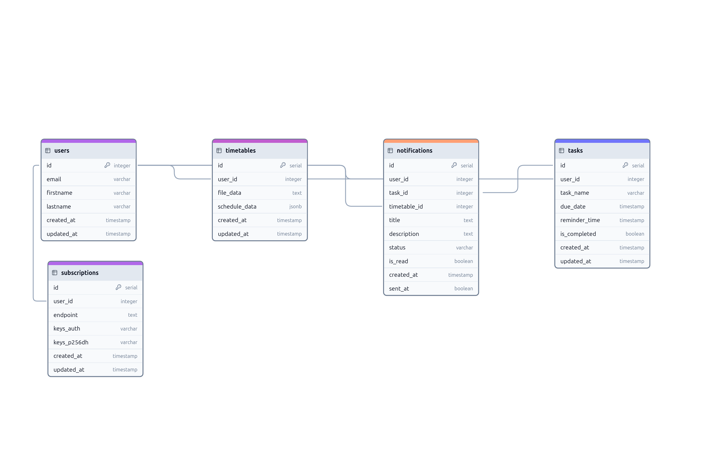
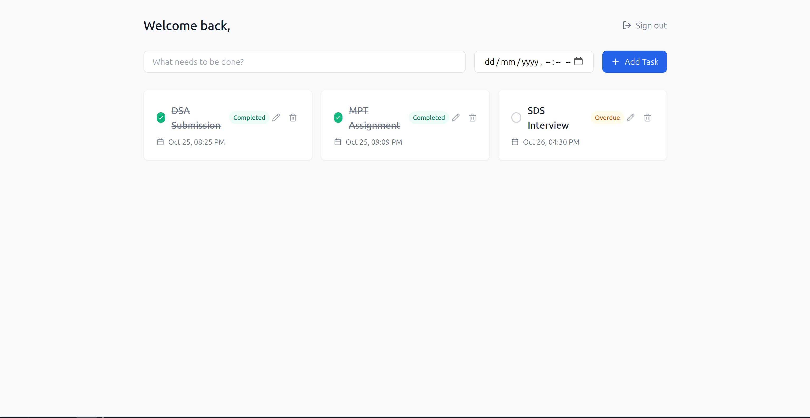
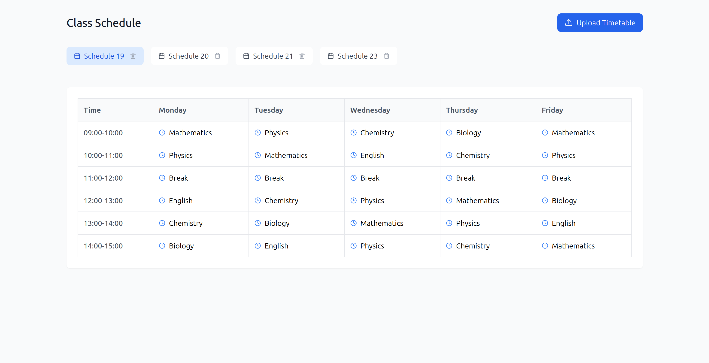
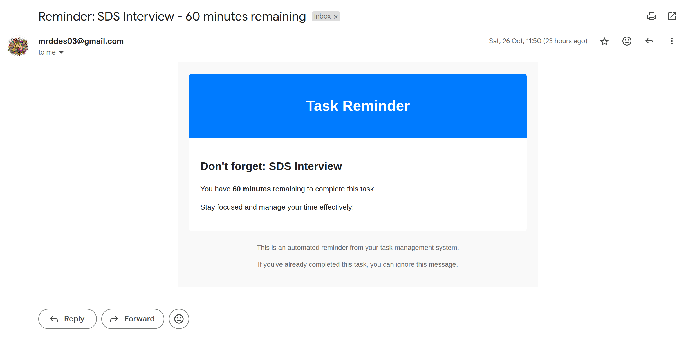
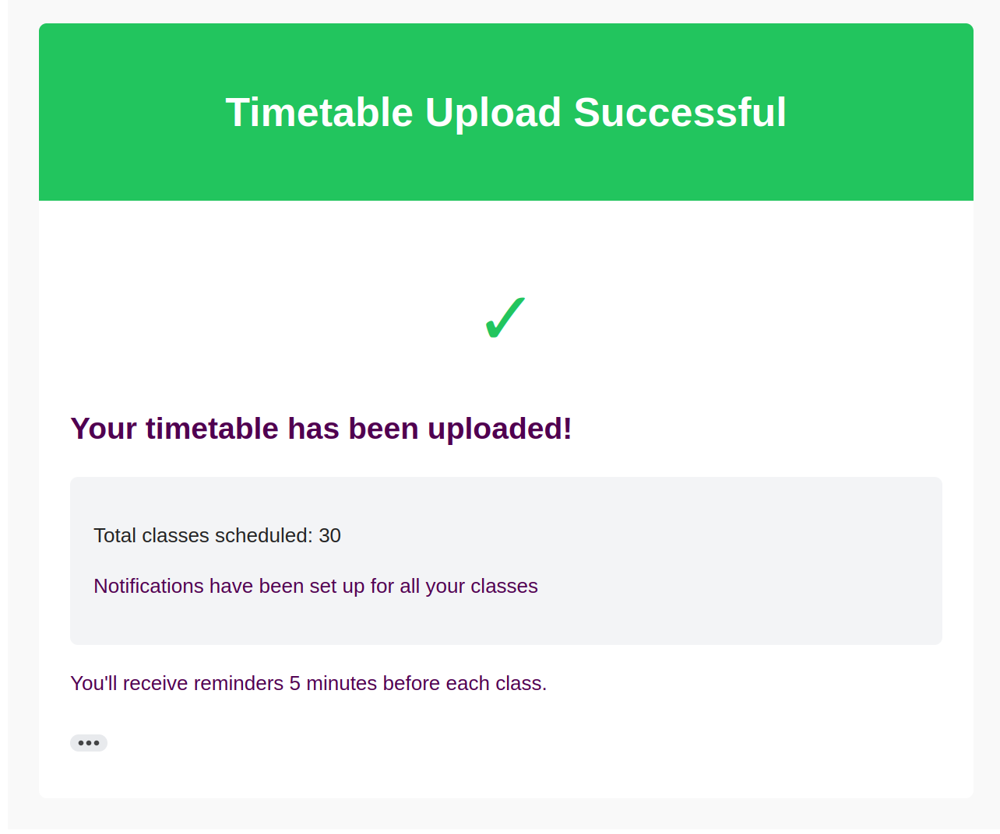

# Notify Me!

## Overview

Notify Me helps you keep track of your tasks by sending reminders right to your browser and email. The app connects with your timetable/schedule to make sure reminders fit your daily schedule. You can create tasks, set due dates, and get notifications wherever you are - on your phone, laptop, or tablet. With Notify Me, you'll stay on top of your to-do list without having to check the app constantly.

## Features

1. **Task Management** : Create, edit, and organize your tasks with custom due dates and priority levels.
2. **Push Notifications** : Get instant alerts in your browser when tasks are due or need attention.
3. **Email Reminders** : Receive backup notifications through email to ensure you never miss important tasks.
4. **Timetable Integration** : Connect your calendar to automatically schedule tasks around your existing commitments.
5. **Cross-Device Sync** : Access your tasks and receive notifications on any device - mobile, tablet, or desktop.
6. **Smart Scheduling** : Set recurring tasks and get reminders based on your working hours and availability.
7. **Real-time Updates** : Changes to tasks are instantly reflected across all your devices.

## Tech Stack

- **Frontend**: React, Tailwind CSS
- **Backend**: Node.js, Express
- **Database**: PostgreSQL (Supabase) and Drizzle ORM 
- **Authentication**: JWT, Supabase
- **Email Service**: Nodemailer
- **Scheduling**: Node cron 

### Database Design


### Images






## Architecture

The backend follows a Model-View-Controller (MVC) architecture, ensuring a clean separation of concerns and better maintainability.


## Getting Started

1. **Clone the repository:**

   ```bash
   git clone https://github.com/Mehmood-Deshmukh/SDS-Induction-Task.git
   ```

2. **Navigate to the project directory:**

   ```bash
   cd SDS-Induction-Task-main
   ```

3. **Set up the server:**

   ```bash
   cd server
   npm install
   nodemon server.js
   ```

4. **Set up the client:**

   ```bash
   cd ../client
   npm install
   npm start
   ```

## Contributing

Contributions are what make the open source community such an amazing place to be learn, inspire, and create. Any contributions you make are **greatly appreciated**.

- If you have suggestions for adding or removing features, feel free to [open an issue](https://github.com/Mehmood-Deshmukh/SDS-Induction-Task/issues/new) to discuss it, or directly create a pull request with necessary changes.
- Create individual PR for each suggestion.

### Creating A Pull Request

1. Fork the Project
2. Create your Feature Branch (`git checkout -b feature/AmazingFeature`)
3. Commit your Changes (`git commit -m 'Add some AmazingFeature'`)
4. Push to the Branch (`git push origin feature/AmazingFeature`)
5. Open a Pull Request

## About the Developers

Notify me is developed by **Mehmood Deshmukh**

### Connect with Me

- LinkedIn: [Mehmood Deshmukh](https://www.linkedin.com/in/mehmood-deshmukh-93533a2a7/)
- GitHub: [Mehmood Deshmukh](https://github.com/Mehmood-Deshmukh)

Feel free to reach out for collaboration, feedback, or just to say hi!
